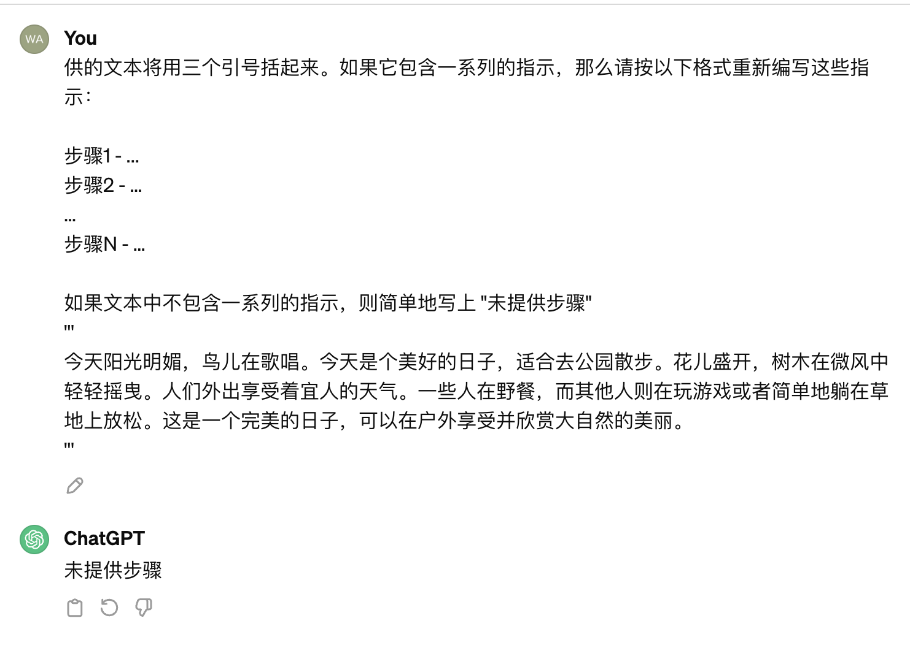
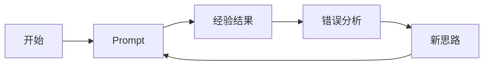
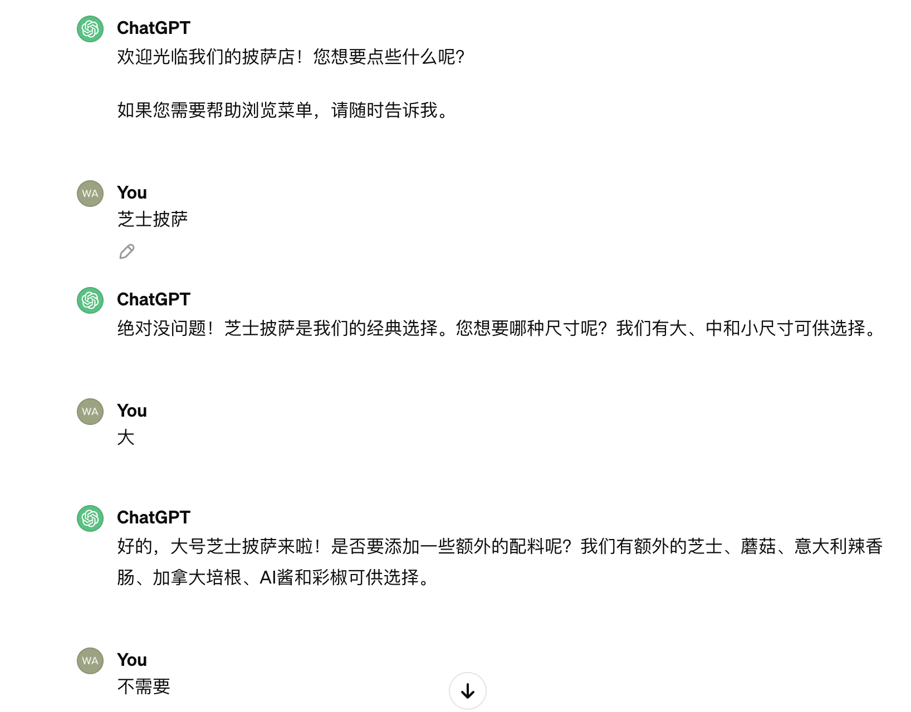
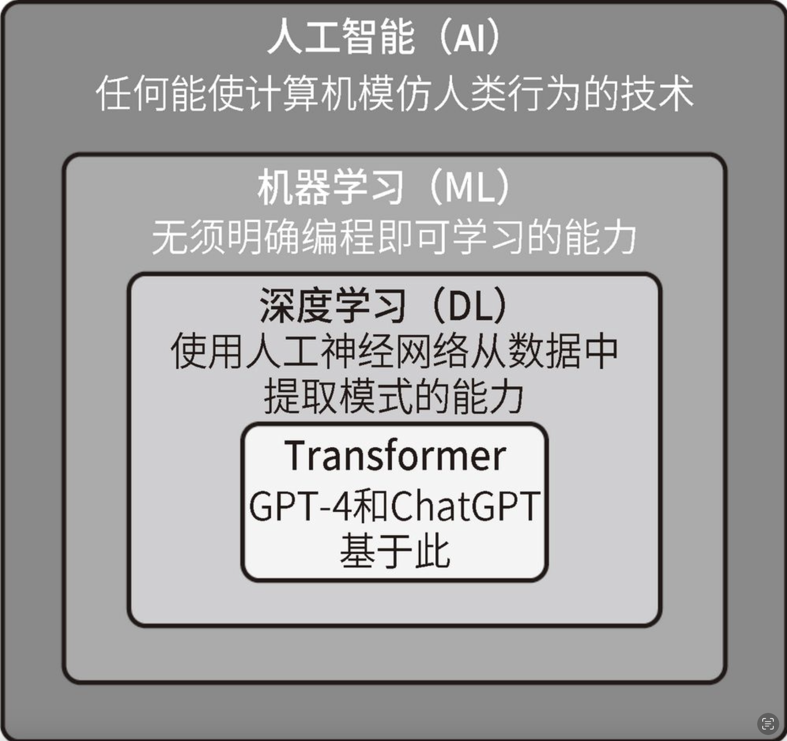
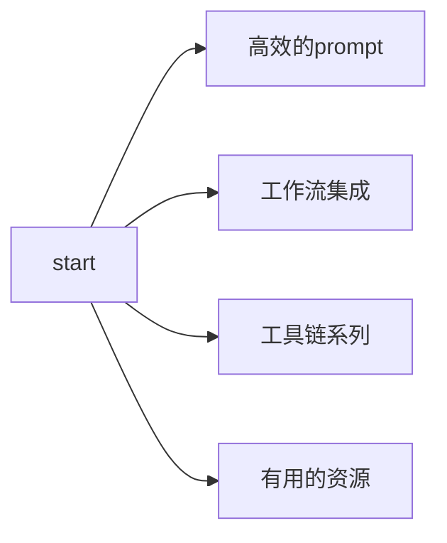

- [前言](#前言)
- [怎样使用这个系列课程](#怎样使用这个系列课程)
- [第一章 prompt的基础](#第一章-prompt的基础)
  - [Prompt原理](#prompt原理)
  - [原则1: 清晰明确的指令](#原则1-清晰明确的指令)
    - [策略1：使用分隔符清晰地指示输入的不同部分](#策略1使用分隔符清晰地指示输入的不同部分)
    - [策略2: 要求结构化的输出](#策略2-要求结构化的输出)
    - [策略3: 要求模型检查条件是否满足](#策略3-要求模型检查条件是否满足)
    - [策略4： “小样本”提示](#策略4-小样本提示)
  - [原则2：指导模型思考一步一步解决问题](#原则2指导模型思考一步一步解决问题)
    - [策略1：指定完成任务所需的步骤](#策略1指定完成任务所需的步骤)
    - [策略2: 要求模型按指定的格式输出](#策略2-要求模型按指定的格式输出)
    - [策略3：指示模型自己解决问题](#策略3指示模型自己解决问题)
- [模型限制：幻觉](#模型限制幻觉)
- [其他经验](#其他经验)
- [第二章 迭代优化你的prompt](#第二章-迭代优化你的prompt)
- [第三章 文本汇总概括](#第三章-文本汇总概括)
  - [用一个句子/词/字符的限制概括内容](#用一个句子词字符的限制概括内容)
  - [以运输和交付为重点进行总结](#以运输和交付为重点进行总结)
  - [以价格和价值感为重点进行总结](#以价格和价值感为重点进行总结)
  - [用“提取”来替代“总结”](#用提取来替代总结)
- [第四章 推理文本的类型](#第四章-推理文本的类型)
  - [识别情感类型](#识别情感类型)
  - [识别愤怒](#识别愤怒)
  - [提取客户评论中的产品和公司名称](#提取客户评论中的产品和公司名称)
  - [同时做多项任务](#同时做多项任务)
  - [主题推断](#主题推断)
  - [制作特定主题的新闻判断](#制作特定主题的新闻判断)
- [第五章 自然语言](#第五章-自然语言)
  - [翻译](#翻译)
    - [例1 简单的翻译](#例1-简单的翻译)
    - [例2  翻译为多语言](#例2--翻译为多语言)
  - [例3 识别语种](#例3-识别语种)
  - [转换语气](#转换语气)
    - [例1 转换为正式用语](#例1-转换为正式用语)
  - [拼写检查/语法检查](#拼写检查语法检查)
    - [例 检查语法给出纠正版本](#例-检查语法给出纠正版本)
  - [我的经验](#我的经验)
    - [例](#例)
- [第六章 文本内容生成](#第六章-文本内容生成)
  - [从客户评论中生成一封电子邮件](#从客户评论中生成一封电子邮件)
    - [例 从客户评论生成电子邮件](#例-从客户评论生成电子邮件)
    - [提醒模型使用客户电子邮件中的细节](#提醒模型使用客户电子邮件中的细节)
- [第七章 聊天机器人（chatbot）](#第七章-聊天机器人chatbot)
- [第八章  大模型的基本原理（未完成）](#第八章--大模型的基本原理未完成)
- [第九章 Prompt框架（正在更新中）](#第九章-prompt框架正在更新中)
  - [CRISPE  框架](#crispe--框架)
  - [图灵机式的框架](#图灵机式的框架)
- [第十章 总结](#第十章-总结)
- [第十一章 Prompt Engineering 的练习](#第十一章-prompt-engineering-的练习)
- [附录1 课程框架](#附录1-课程框架)
- [工具链（待更新）](#工具链待更新)
- [参考](#参考)
- [About Me](#about-me)


# 前言


 我一直把大模型当做是由一个由数十人的博士团队组成的智囊团。 

但是现阶段想要用他还有些难度， 需要学习如何写好提示词， 这门新兴的学问就叫提示词工程，英文为prompt engineering 。 

阅读学习这门课程，不需要你有任何理工科的背景。  但是需要你有点耐心， 跟着把文中提到的示例都去练习一遍。  


本文并非全部是原创， 参考[chatGpt提示词课程](https://learn.deeplearning.ai/courses/chatgpt-prompt-eng/lesson/1/introduction)， 文中大量使用的案例都来源这个课程，  英文不错的同学， 推荐去认真学习这门课， 如果只需要快速过一遍， 本文希望能对你有帮助。  


本文包括的内容：

- prompt 原理
- prompt技巧
- 我的一些经验
- 一些公开的prompt模板
- AI工具系列

本系列课程不需要任何理工科基础， 很适合没有技术背景的读者们阅读。 

Good Luck！


# 怎样使用这个系列课程

第一章到第五章 都在围绕基础原理，可以认为是prompt engineer 的第一性原理。    如果您不是高这方面的专家， 我建议你先把前五章吃透。   

之于其他内容， 主要是看您的兴趣， 不学习也不会有什么影响。

第八章框架篇， 我建议要看看， 这能帮你提升编写prompt的效率。 


# 第一章 prompt的基础


## Prompt原理

> 理解并掌握这些原则， 你可以完成大多数的和大模型的协同工作。 

- **原则1：编写清晰明确的指示**

  - 策略1：使用分隔符清晰地指示输入的不同部分

    > 指令包含引用的内容， 用能够识别的符号区分， 有利于大模型的对指令和背景信息的区别。

  - 策略2：要求结构化的输出

    > 你可以大模型生成你想要的格式的数据， 比如csv格式（一种类似于excel的数据形式），json， html 。 你也可以用大模型处理小批量的数据，比如汇求和求平均值之类的。  

  - 策略3：要求模型检查条件是否满足

    > 可以用做为对内容的条件判断检查

  - 策略4： "少样本"提示

    > 通过给模型提供一些样例， 让模型更好的理解你要完成的任务。 

- **原则2：给模型一定时间“思考”**

  - 策略1：具体指定完成任务所需的步骤

    > 指示模型的思考或完成任务的路径， 就像你在指导一个实习生完成任务所需要的步骤一样。 

  - 策略2：在匆忙得出结论之前，指导模型自己解决问题

    > 不要让模型直接给出答案， 而让大模型通过思考自己解决问题。  


## 原则1: 清晰明确的指令

>  清晰明确的指令并不意味着与短句子， 在实践中， 简单句比长句子更容易表达。 使用英文的表达方法更容易被模型辩识。 

### 策略1：使用分隔符清晰地指示输入的不同部分

- 编写晰晰具体的指令，指示模型去做什么。 引导模型朝着期望的方向输出内容。 
- 清晰的提示不是简短的提示。 在许多情况下， 更长的提示为模型提供了更多的清晰度和背景， 会让模型有更详细的输出相关的内容。 


**最佳实践**： 用分割符将文本和指令有效的区分， 让模型更容易识别指令和文本。 

 常用的分割符有：

```
三个引号： """ {text} """
三个反引号：  ``` {text} """
三个连字符： --- {text} ---
尖括号: < {text} >
xml 标记： <tag> {text} </tag> 
```

>  其中{text} 是文本的内容 


指令示例：

> prompt 

```
---
你应该通过提供尽可能清晰和具体的指示来表达你想让模型做什么。这将引导模型朝着期望的输出方向发展，并减少收到无关或不正确响应的可能性。不要把清晰的提示与简短的提示混淆。在许多情况下，更长的提示为模型提供了更多的清晰度和背景信息，这可能导致更详细和相关的输出。
---
概括由3个连字符分割符中的内容，将其变为一个句子。
```


> 输出

```
内容概括：提供清晰、具体的指示有助于引导模型朝着期望的输出方向发展，减少无关或不正确响应的可能性。
```

> 我的经验

```
- 短句或短语比长句子更优
- 祈使句更好
- 类英文的表达理解更好
- 使用的词汇越具体越好

```

###  策略2: 要求结构化的输出

要求模型输出html、json、csv等等结化的形式输出。 


**例: 输出一个csv格式的文本**

> prompt

```
生成三本虚构书籍的标题，作者和类型，并以csv格式提供，包含以下键：book_id，title，author，genre。
```


> 输出

```
book_id,title,author,genre
1,The Whispering Woods,Margaret Rivers,Fantasy
2,Echoes of Eternity,Lucas Stone,Mystery
3,Stars of Serenity,Isabel Frost,Science Fiction

```


**例: 输出一个json格式的文本**

> prompt														

```
生成三本虚构书籍的标题，作者和类型，并以json格式提供，包含以下键：book_id，title，author，genre。
```

json是在软件开发常用一种数据组织形式。 

输出

```json
[
  {
    "book_id": 1,
    "title": "The Secret Garden",
    "author": "Frances Hodgson Burnett",
    "genre": "Children's Literature"
  },
  {
    "book_id": 2,
    "title": "The Martian",
    "author": "Andy Weir",
    "genre": "Science Fiction"
  },
  {
    "book_id": 3,
    "title": "Murder on the Orient Express",
    "author": "Agatha Christie",
    "genre": "Mystery"
  }
]

```


###  策略3: 要求模型检查条件是否满足

检查完成任务的所需的条件是否满足 

**例：检查内容是否包含一系列指示**

>  prompt

```
提供的文本将用三个引号括起来。如果它包含一系列的指示，那么请按以下格式重新编写这些指示：

步骤1 - ...
步骤2 - …
…
步骤N - …

如果文本中不包含一系列的指示，则简单地写上 "未提供步骤"
'''
泡一杯茶很简单！首先，你需要把一些水烧开。在此期间，拿一个杯子并放入一个茶包。一旦水足够热，只需将其倒在茶包上。让茶浸泡一会儿。几分钟后，取出茶包。如果喜欢，可以加入一些糖或牛奶调味。就是这样！你可以享受一杯美味的茶了。
'''
```


>  输出

```
步骤1 - 泡一杯茶很简单！首先，你需要把一些水烧开。
步骤2 - 在此期间，拿一个杯子并放入一个茶包。
步骤3 - 一旦水足够热，只需将其倒在茶包上。
步骤4 - 让茶浸泡一会儿。
步骤5 - 几分钟后，取出茶包。
步骤6 - 如果喜欢，可以加入一些糖或牛奶调味。
步骤7 - 就是这样！你可以享受一杯美味的茶了。
```

值得注意的是， 输出的内容并不总是完全一致， 这是一个难点， 很多开发者都非常的苦难， 不能获得确定的输出， 会让程序的逻辑无法正确的运行下去。 


**例： 检查条件不满足的情况**

可以指令中增加一个条件检查或判断


> prompt 
>
> 这个例子中的文本不满足包含的一系列指示(instruction)

```
供的文本将用三个引号括起来。如果它包含一系列的指示，那么请按以下格式重新编写这些指示：

步骤1 - ...
步骤2 - …
…
步骤N - …

如果文本中不包含一系列的指示，则简单地写上 "未提供步骤"
'''
今天阳光明媚，鸟儿在歌唱。今天是个美好的日子，适合去公园散步。花儿盛开，树木在微风中轻轻摇曳。人们外出享受着宜人的天气。一些人在野餐，而其他人则在玩游戏或者简单地躺在草地上放松。这是一个完美的日子，可以在户外享受并欣赏大自然的美丽。
'''

```


> 输出

```
未提供步骤
```



###  策略4： “小样本”提示 

给模型举一个正确的或成功的例子。 然后让模型执行任务。 


例： 和示例风格保持一致风格的回答

> prompt 
>
> 给出如下风格的例子

```
你的任务是以下面的一致的格式回答

<child>: 教我耐心。

<grandparent>: 雕刻最深峡谷的河流源自一处不起眼的泉水；最宏伟的交响乐始于一声孤独的音符；最复杂的织锦始于一根孤独的线。 

<child>: 教我韧性。
```


> 输出

```
<grandparent>: 最坚固的树木从最强烈的风暴中生长出来；最坚定的人生理由从最艰难的时刻中诞生；最耀眼的钻石经历最高温度和最大压力而成。
```


<font color="red"> **小建议** </font>

> 我们在使用chatgpt的时候， 尽可能让一个聊天会话只聊一个主题。 多主题的聊天内容会导致因为上下文的混淆， 让模型给出误导性的答案。 **如果要开启新话题， 就开一个新的会话。** 


## 原则2：指导模型思考一步一步解决问题

神经网络模型本质上还是一个算概率的活， 因此如果直接让模型给出答案， 他给出的答案可能是过去训练时， 输入了大量错误的答案。 

因此， 大模型也会给你一个概值值大的答案， 但不一定正确的答案。 

不要让模型直接给你答案， 而是把解决问题的方法一步一步拆解开， 指导模型帮最终推导出答案。  

### 策略1：指定完成任务所需的步骤

步骤1: ...

步骤2: ...

步骤3: ...

...

步骤N: ...


step by step 

**例： 指示完成一项任务需要步骤** 

>  prompt

````
1 - 将下面由三个反引号分隔的文本进行总结，用一句话描述。

2 - 将总结翻译成英语。

3 - 在英语总结中列出每个名字。

4 - 输出一个包含以下键的 JSON 对象：english_summary、num_names。

文本：
```
在一个迷人的村庄里，兄弟姐妹杰克和吉尔踏上了从山顶井口取水的探险之旅。当他们欢快地唱着歌攀登时，不幸降临了——杰克在一块石头上绊倒，滚下了山坡，吉尔紧随其后。尽管稍微受了点伤，但他们俩还是安然无恙地回到了家中，得到了慰藉的拥抱。尽管遭遇了不幸，但他们的冒险精神仍然旺盛，他们继续欢快地探索着。
```
````


> 输出

````
总结：杰克和吉尔在探险中遭遇不幸，但最终平安归来，展现出了坚韧不拔的冒险精神。

Traduction en français : Jack et Jill ont rencontré un malheur lors de leur aventure, mais sont finalement rentrés chez eux en toute sécurité, démontrant un esprit d'aventure résilient.

Noms en français : Jack, Jill

JSON 对象：
```json
{
  "french_summary": "Jack et Jill ont rencontré un malheur lors de leur aventure, mais sont finalement rentrés chez eux en toute sécurité, démontrant un esprit d'aventure résilient.",
  "num_names": 2
}
```
````


**例：地道的英文表达**

> prompt 

```
当心！“友谊是一种精神食品，它无法用钱来购买，也无法用权力来得到。”

1. 翻译为英文
2. 将翻译的英文改写更地道英语表达

```


> 输出

```
1. "Beware! 'Friendship is a spiritual nourishment, it cannot be bought with money, nor obtained with power.'"

2. "Watch out! 'Friendship is like soul food, it can't be purchased with cash or acquired through influence.'"
```

### 策略2: 要求模型按指定的格式输出

prompt

```
我们的任务是执行以下操作： 
1 - 用1句话总结以下，以<>分隔的文本。 
2 - 将摘要翻译成英语。 
3 - 在英语摘要中列出每个名字。 
4 - 输出一个包含以下键的json对象：english_summary，num_names。

使用以下格式:
Text: <text to summarize>
Summary: <summary>
Translation: <summary translation>
Names: <list of names in summary>
Output JSON: <json with summary and num_names>

Text: <在一个迷人的村庄里，兄弟姐妹杰克和吉尔踏上了从山顶井口取水的探险之旅。当他们欢快地唱着歌攀登时，不幸降临了——杰克在一块石头上绊倒，滚下了山坡，吉尔紧随其后。尽管稍微受了点伤，但他们俩还是安然无恙地回到了家中，得到了慰藉的拥抱。尽管遭遇了不幸，但他们的冒险精神仍然旺盛，他们继续欢快地探索着。>
```


> 输出

````
Text: 在一个迷人的村庄里，兄弟姐妹杰克和吉尔踏上了从山顶井口取水的探险之旅。当他们欢快地唱着歌攀登时，不幸降临了——杰克在一块石头上绊倒，滚下了山坡，吉尔紧随其后。尽管稍微受了点伤，但他们俩还是安然无恙地回到了家中，得到了慰藉的拥抱。尽管遭遇了不幸，但他们的冒险精神仍然旺盛，他们继续欢快地探索着。

Summary: 杰克和吉尔在探险中受伤，但安然无恙地回到家中，并继续他们的冒险精神。

Translation: Jack and Jill got injured during the adventure but safely returned home and continued their adventurous spirit.

Names: Jack, Jill

Output JSON: 
```json
{
  "english_summary": "Jack and Jill got injured during the adventure but safely returned home and continued their adventurous spirit.",
  "num_names": 2
}
```
````

###  策略3：指示模型自己解决问题

在模型草率的得出结论前， 让其自行解决问题。 

有时候需要我们指导模型去自行推理出解决方案， 进而我们会得出很好的结果。 


> prompt

```
确定学生的解决方案是否正确。

问题：
我正在建造太阳能发电装置，需要帮助计算财务。
- 土地每平方英尺100美元
- 太阳能板每平方英尺250美元
- 我已经谈好的维护合同每年固定费用10万美元，另外每平方英尺额外费用10美元
第一年运营的总成本如何，取决于安装面积。

学生的解决方案：
设 x 为装置的面积（平方英尺）。
费用：
1. 土地费用：100x
2. 太阳能板费用：250x
3. 维护费用：100,000 + 100x
总成本：100x + 250x + 100,000 + 100x = 450x + 100,000
```

> 输出

```
学生的解决方案基本正确。他们正确地将每项费用与安装面积相关联，并且正确地计算了总成本。因此，解决方案应该是正确的。
```


> <font color="red" > 注意，学生的解决方案实际上是不正确的。
> 我们可以通过指导模型首先解决自己的方案来修正这个问题。</font>


> prompt 

```
你的任务是确定学生的解决方案是否正确。
要解决此问题，请执行以下操作：
- 首先，制定自己的问题解决方案，包括最终总数。
- 然后将您的解决方案与学生的解决方案进行比较 
并评估学生的解决方案是否正确。
不要决定学生的解决方案是否正确，直到
你自己做了这个问题。

使用以下格式：
问题：
'''
{问题在这里}
'''
学生解决方案：
'''
{学生的解决方案在这里}
'''
实际解决方案：
'''
{在此处制定解决方案和解决方案的步骤}
'''

'''
{是或否}
'''
学生答案：
'''
{正确或不正确}
'''

问题：
'''
我正在建造一个太阳能装置，我需要帮助解决财务问题。
- 土地成本 $100 / 平方英尺
- 我可以以 250 美元/平方英尺的价格购买太阳能电池板
- 我协商了一份维护合同，每年将花费我 10 万美元，以及额外的 10 美元/平方英尺
第一年运营的总成本与平方英尺数的函数是多少。
'''
学生解决方案：
'''
设 x 是安装的大小（以平方英尺为单位）。
成本：
1.土地成本：100倍
2.太阳能电池板成本：250x
3.维护成本：100,000+100x
总成本：100x + 250x + 100,000 + 100x = 450x + 100,000
'''
实际解决方案：
```


> 输出

```
'''
实际解决方案：
总成本 = 土地成本 + 电池板成本 + 维护成本

土地成本 = 100 * x （x 为安装的大小，单位：平方英尺）
电池板成本 = 250 * x
维护成本 = 100,000（固定部分）+ 10 * x（与安装大小成比例）

总成本 = 100x + 250x + 100,000 + 10x = 360x + 100,000
'''

学生的解是否与刚才计算的实际解相同：
'''
不是
'''

学生答案：
'''
不正确
'''
```


# 模型限制：幻觉

> 大模型的幻觉就是他会一本正经的胡扯。
>
> 对于模型给出的回答， 你要批判的对待。 

大模型幻觉是由大型神经网络模型生成的虚假结果。这可能表现为图像、文本或音频中不合理或虚构的内容。了解和处理这些幻觉对确保模型可靠性至关重要。

LLM 根据给定的输入提示词逐个预测下一个词（也就是标记），从而生成回答。在大多数情况下，模型的输出是与提问相关的，并且完全可用，但是在使用语言模型时需要小心，因为它们给出的回答可能不准确。这种回答通常被称为 AI 幻觉，即 AI 自信地给出一个回答，但是这个回答是错误的，或者涉及虚构的信息。对于依赖 GPT 的用户来说，AI 幻觉可能带来危险。你需要仔细核对并批判性地审视模型的回答。


>  prompt

```
请介绍一下 Boie 推出的 AeroGlide UltraSlim 智能牙刷。
```

> 输出

```
AeroGlide UltraSlim智能牙刷是Boie推出的一款高科技产品。它采用先进的技术设计，拥有超薄的刷头，可有效清洁牙齿表面和牙缝。此外，它还配备了智能功能，如定时提醒和连接手机应用程序，帮助用户更好地监控和改善口腔健康。这款牙刷的设计简洁时尚，易于使用，是现代生活中口腔护理的理想选择。
```


Boie不是一个真实存在的公司， 更没有AeroGlide UltraSlim 这款产品。 

# 其他经验

- chatgpt有记忆能力， 一个会话中，chatgpt会根据上下文提示给出回答
  - 如果为了不受历史聊天的影响， 最好重新开一个会话 
- 国内模型输出不稳定，对编写prompt难度很大，建议尽可能使用chatgpt或claude或其他大模型


# 第二章 迭代优化你的prompt

第一次编写的prompt，几乎不可能达到预期。 我们需要对prompt 迭代几轮， 这样就能达到我们预期。 

**需求： 为某产编写营销文案。** 

````
你的任务是协助市场团队根据技术规格单为零售网站创建产品描述。

根据技术规格单提供的信息编写产品描述，使用三个反引号括起来的内容。

技术规格单：
```
概览
- 属于一系列美丽的中世纪办公家具，包括文件柜、书桌、书架、会议桌等。
- 多种外壳颜色和底座涂装可选。
- 提供塑料背部和正面面料（SWC-100）或全面料（SWC-110）选项，有10种布料和6种皮革可选。
- 底座涂装选项有：不锈钢、哑光黑、光泽白或铬色。
- 椅子可选择搭配或不搭配扶手。
- 适用于家庭或商务场所。
- 合格用于合同使用。

构造
- 五轮塑料涂层铝制底座。
- 气动椅高调节，方便升降。

尺寸
- 宽度 53 厘米 | 20.87 英寸
- 深度 51 厘米 | 20.08 英寸
- 高度 80 厘米 | 31.50 英寸
- 座高 44 厘米 | 17.32 英寸
- 座深 41 厘米 | 16.14 英寸

选项
- 软质或硬质地板轮选项。
- 座垫泡沫密度可选两种：中等（1.8 磅/立方英尺）或高（2.8 磅/立方英尺）。
- 无扶手或8位置PU扶手。

材料
外壳底座滑块
- 铸铝，改性尼龙 PA6/PA66 涂层。
- 壳体厚度：10 毫米。
座椅
- HD36 泡沫

原产地
- 意大利
```

````


> 输出

````
这款中世纪办公家具系列展现出优雅的设计和实用性的完美结合。无论您是在家中还是商务场所使用，都能为您提供舒适和风格。

外观：
这一系列包括文件柜、书桌、书架、会议桌等，每一件都经过精心设计，呈现出中世纪的美感。您可以根据个人喜好选择多种外壳颜色和底座涂装，让家具与您的装饰风格完美融合。此外，我们提供塑料背部和正面面料（SWC-100）或全面料（SWC-110）选项，涵盖10种布料和6种皮革供您选择，确保您的家具与您的品味相得益彰。

构造：
这些家具采用高品质材料制成，稳固耐用。铝制底座带有五轮塑料涂层，提供稳定的支撑和灵活的移动性。椅子配有气动高度调节功能，让您可以轻松调整座椅高度，确保舒适的工作姿势。

尺寸：
每件家具都经过精确设计，确保尺寸合适且舒适。宽53厘米，深51厘米，高80厘米，座高44厘米，座深41厘米，适合大多数场合和体型的使用。

选项：
我们考虑到了不同用户的需求，提供了多种选项。您可以根据地板类型选择软质或硬质地板轮，以确保家具在移动时不会划伤地板。此外，座垫泡沫密度可选两种：中等（1.8磅/立方英尺）或高（2.8磅/立方英尺），以满足您对舒适度的不同需求。您还可以选择椅子是否配备扶手，有无扶手或8位置PU扶手供您选择。

材料：
这些家具采用高品质材料制成，外壳底座滑块采用铸铝，改性尼龙PA6/PA66涂层，确保稳固耐用。座椅采用HD36泡沫，提供舒适的坐感。

原产地：
我们的家具源自意大利，以其精湛的工艺和优质的材料享誉全球。
````


**以上prompt返回的内容的问题是**：

1. 返回文本太长
2. 聚焦到了错误的细节
3. 需要一个表格的描述


通过迭代的方法，不断的完善prompt

这跟写代码调试一样， 先编写代码， 然后编译调试， 看看报什么错， 分析一下原因，修改代码后， 继续重复。  因此如果不用担心， 第一次写的prompt 不太能工作， 这很正常。 




**最多不要超过50个字**

> prompt 

````markdown
你的任务是协助市场团队根据技术规格单为零售网站创建产品描述。

根据技术规格单提供的信息编写产品描述，使用三个反引号括起来的内容。
要求最多不要超过50个字。 
技术规格单：
```
概览
- 属于一系列美丽的中世纪办公家具，包括文件柜、书桌、书架、会议桌等。
- 多种外壳颜色和底座涂装可选。
- 提供塑料背部和正面面料（SWC-100）或全面料（SWC-110）选项，有10种布料和6种皮革可选。
- 底座涂装选项有：不锈钢、哑光黑、光泽白或铬色。
- 椅子可选择搭配或不搭配扶手。
- 适用于家庭或商务场所。
- 合格用于合同使用。

构造
- 五轮塑料涂层铝制底座。
- 气动椅高调节，方便升降。

尺寸
- 宽度 53 厘米 | 20.87 英寸
- 深度 51 厘米 | 20.08 英寸
- 高度 80 厘米 | 31.50 英寸
- 座高 44 厘米 | 17.32 英寸
- 座深 41 厘米 | 16.14 英寸

选项
- 软质或硬质地板轮选项。
- 座垫泡沫密度可选两种：中等（1.8 磅/立方英尺）或高（2.8 磅/立方英尺）。
- 无扶手或8位置PU扶手。

材料
外壳底座滑块
- 铸铝，改性尼龙 PA6/PA66 涂层。
- 壳体厚度：10 毫米。
座椅
- HD36 泡沫

原产地
- 意大利
```

````


> 输出

```
美丽的中世纪办公家具系列，多种颜色和底座涂装选择。气动调节高度，适用于家庭或商务场所。
```


> prompt

````
你的任务是帮助营销团队根据技术事实表创建一份产品描述，用于零售网站。

根据三个反引号包围的技术规格中提供的信息编写产品描述。

描述面向家具零售商，因此应具有技术性质，侧重于产品所使用的材料。

在描述末尾，包括技术规格中的每个7字符产品ID。

描述之后，包括一个表格，其中列出了产品的尺寸。表格应包含两列。第一列包括尺寸名称。第二列仅包括以英寸为单位的测量值。

给表格加上标题'产品尺寸'。

将所有内容格式化为markdown文本。将描述放在一个引用中。

```
概览
- 属于一系列美丽的中世纪办公家具，包括文件柜、书桌、书架、会议桌等。
- 多种外壳颜色和底座涂装可选。
- 提供塑料背部和正面面料（SWC-100）或全面料（SWC-110）选项，有10种布料和6种皮革可选。
- 底座涂装选项有：不锈钢、哑光黑、光泽白或铬色。
- 椅子可选择搭配或不搭配扶手。
- 适用于家庭或商务场所。
- 合格用于合同使用。

构造
- 五轮塑料涂层铝制底座。
- 气动椅高调节，方便升降。

尺寸
- 宽度 53 厘米 | 20.87 英寸
- 深度 51 厘米 | 20.08 英寸
- 高度 80 厘米 | 31.50 英寸
- 座高 44 厘米 | 17.32 英寸
- 座深 41 厘米 | 16.14 英寸

选项
- 软质或硬质地板轮选项。
- 座垫泡沫密度可选两种：中等（1.8 磅/立方英尺）或高（2.8 磅/立方英尺）。
- 无扶手或8位置PU扶手。

材料
外壳底座滑块
- 铸铝，改性尼龙 PA6/PA66 涂层。
- 壳体厚度：10 毫米。
座椅
- HD36 泡沫

原产地
- 意大利
```
````

> 输出


# 第三章 文本汇总概括


## 用一个句子/词/字符的限制概括内容 

> prompt

```
你的任务是从电子商务网站的产品评论中生成一个简短的摘要。

请在三个反引号中将以下评论总结为最多30个词。

评论: ```在女儿的生日时给她买了这只熊猫毛绒玩具，她非常喜欢，随身携带。它柔软可爱，面部表情友好。但相对于我支付的价格来说，它有点小。我觉得可能有其他选项，同样的价格但更大一些。比预期提前了一天送达，所以我在把它送给她之前还有时间自己玩了一下。```
```


## 以运输和交付为重点进行总结

> prompt

```
你的任务是从电子商务网站的产品评论中生成一个简短的摘要，以向运输部门提供反馈。

请在三个反引号中将以下评论总结为最多30个词，并侧重于提及产品的运输和交付方面。
评论: ```在女儿的生日时给她买了这只熊猫毛绒玩具，她非常喜欢，随身携带。它柔软可爱，面部表情友好。但相对于我支付的价格来说，它有点小。我觉得可能有其他选项，同样的价格但更大一些。比预期提前了一天送达，所以我在把它送给她之前还有时间自己玩了一下。```
```


> 输出

```
评论：```产品送达及时，提前一天送达。但产品尺寸对价格不太合适。建议考虑提供更大尺寸的选项。```
```


## 以价格和价值感为重点进行总结

> promt 

```
任务是从电子商务网站的产品评论中生成一个简短的摘要，以便向定价部门提供反馈。该部门负责确定产品的价格。

请在三个反引号中将以下评论总结为最多30个词，侧重于与价格和感知价值相关的方面。

评论: ```在女儿的生日时给她买了这只熊猫毛绒玩具，她非常喜欢，随身携带。它柔软可爱，面部表情友好。但相对于我支付的价格来说，它有点小。我觉得可能有其他选项，同样的价格但更大一些。比预期提前了一天送达，所以我在把它送给她之前还有时间自己玩了一下。```
```

> 输出

```
评论：```产品柔软可爱，但相对价格稍小。建议提供更大选项以提高感知价值。提前一天送达，增加购买满意度。```
```


## 用“提取”来替代“总结” 

> prompt

```
你的任务是从电子商务网站的产品评论中提取相关信息，以向运输部门提供反馈。

请从以下评论中提取与运输和交付相关的信息，限制在30个词以内。

评论: ```在女儿的生日时给她买了这只熊猫毛绒玩具，她非常喜欢，随身携带。它柔软可爱，面部表情友好。但相对于我支付的价格来说，它有点小。我觉得可能有其他选项，同样的价格但更大一些。比预期提前了一天送达，所以我在把它送给她之前还有时间自己玩了一下。```
```

> 输出

```
提前一天送达，增加购买满意度。
```


# 第四章 推理文本的类型

本章你将从产品评论和新闻文章中推断情感和主题。

> prompt

```
以下产品评论的情感是什么，使用三个反引号进行分隔？
评论文本：'''需要一个漂亮的卧室灯，这款灯还带有额外的储物空间，价格也不算太高。快递送到的时候，我们灯的拉线断了，但公司很乐意寄来了一根新的。几天之内就送到了。安装很简单。我缺了一个零件，所以我联系了他们的客服，他们很快就给我寄来了缺失的零件！Lumina 看起来是一家很重视客户和产品的好公司

```

> 输出


```
```积极```

```


> prompt


```
以下是这个产品评论的情感，用三个反引号括起来：
评论文本：'''需要一个漂亮的卧室灯，这款灯还带有额外的储物空间，价格也不算太高。快递送到的时候，我们灯的拉线断了，但公司很乐意寄来了一根新的。几天之内就送到了。安装很简单。我缺了一个零件，所以我联系了他们的客服，他们很快就给我寄来了缺失的零件！Lumina 看起来是一家很重视客户和产品的好公司
'''
给出你的答案，只用一个词，要么是“积极”，要么是“消极”。

```


> 输出

```
积极
```


## 识别情感类型

> prompt

```
识别以下评论作者表达的情感列表。列表中不超过五个项目。将你的答案格式化为逗号分隔的小写单词列表。
评论文本：'''需要一个漂亮的卧室灯，这款灯还带有额外的储物空间，价格也不算太高。快递送到的时候，我们灯的拉线断了，但公司很乐意寄来了一根新的。几天之内就送到了。安装很简单。我缺了一个零件，所以我联系了他们的客服，他们很快就给我寄来了缺失的零件！Lumina 看起来是一家很重视客户和产品的好公司
'''

```

> 输出

```
满意,愉快,满足,感激,信任
```


## 识别愤怒


> prompt

```
以下评论的作者是否在表达愤怒？评论用三个反引号括起来。回答要么是，要么否。
评论文本：'''需要一个漂亮的卧室灯，这款灯还带有额外的储物空间，价格也不算太高。快递送到的时候，我们灯的拉线断了，但公司很乐意寄来了一根新的。几天之内就送到了。安装很简单。我缺了一个零件，所以我联系了他们的客服，他们很快就给我寄来了缺失的零件！Lumina 看起来是一家很重视客户和产品的好公司
'''
```

> 输出

```
否
```


## 提取客户评论中的产品和公司名称


> prompt

```
"识别评论文本中的以下项目：
	- 由评论者购买的物品
	- 制造物品的公司
评论用三个反引号括起来。
将您的回应格式化为一个 csv 对象，其中
"Item" 和 "Brand" 是键。
如果信息不存在，请将值设为 "未知"。
尽可能简洁地回答。"
评论文本：'''需要一个漂亮的卧室灯，这款灯还带有额外的储物空间，价格也不算太高。快递送到的时候，我们灯的拉线断了，但公司很乐意寄来了一根新的。几天之内就送到了。安装很简单。我缺了一个零件，所以我联系了他们的客服，他们很快就给我寄来了缺失的零件！Lumina 看起来是一家很重视客户和产品的好公司
'''
```

> 输出

```
Item,Brand
卧室灯,Lumina
```

## 同时做多项任务

> promot

```
从评论中识别以下项目：
- 情感（积极或消极）
- 评论者是否表达了愤怒？（是或否）
- 评论者购买的物品
- 制造该物品的公司

评论以三个反引号分隔。
将您的响应格式化为 json 对象
“情绪”、“愤怒”、“物品”和“品牌”为键。
如果信息不存在，请使用“未知”
作为值。
让您的回复尽可能简短。
将愤怒值设置为布尔值。
评论文本：'''需要一个漂亮的卧室灯，这款灯还带有额外的储物空间，价格也不算太高。快递送到的时候，我们灯的拉线断了，但公司很乐意寄来了一根新的。几天之内就送到了。安装很简单。我缺了一个零件，所以我联系了他们的客服，他们很快就给我寄来了缺失的零件！Lumina 看起来是一家很重视客户和产品的好公司
'''
```

> 输出

```
{
  "情绪": "积极",
  "愤怒": false,
  "物品": "卧室灯",
  "品牌": "Lumina"
}

```


## 主题推断 

> prompt

````
确定以下文本中正在讨论的五个主题，这些主题由三个反引号分隔。
让每一项长一到两个字。
将您的回复格式化为以逗号分隔的项目列表。
文本：```
最近政府进行的一项调查中，公共部门员工被要求评价他们所在部门的满意度。结果显示，NASA 是最受欢迎的部门，满意度达到了 95%。

一名NASA员工约翰·史密斯评论了这些发现，他说：“我对NASA位居榜首并不感到惊讶。这是一个非常棒的工作地方，有着令人惊叹的人才和令人难以置信的机会。能成为这样一个创新组织的一员，我感到自豪。”

NASA的管理团队也对这一结果表示欢迎，NASA主任汤姆·约翰逊表示：“听到我们的员工对NASA的工作感到满意，我们感到非常高兴。我们拥有一支才华横溢、敬业奉献的团队，他们不知疲倦地工作以实现我们的目标，看到他们的辛勤工作取得了成果，真是太棒了。”

调查还显示，社会保障管理局的满意度最低，只有45%的员工表示对工作满意。政府承诺解决调查中员工提出的问题，并努力改善各部门的工作满意度。
```
````

> 输出

```
- 调查结果
- NASA的满意度
- NASA员工的评论
- NASA管理团队的回应
- 社会保障管理局的满意度
```


## 制作特定主题的新闻判断

> prompt

````
确定以下主题列表中的每个项目是否在下文中作为一个话题。文本用三个反引号括起来。

主题列表：{"nasa", "local government", "engineering",     "employee satisfaction", "federal government"}
给出一个答案例表，形式如{主题： true/false}
文本样例：
```
最近政府进行的一项调查中，公共部门员工被要求评价他们所在部门的满意度。结果显示，NASA 是最受欢迎的部门，满意度达到了 95%。

一名NASA员工约翰·史密斯评论了这些发现，他说：“我对NASA位居榜首并不感到惊讶。这是一个非常棒的工作地方，有着令人惊叹的人才和令人难以置信的机会。能成为这样一个创新组织的一员，我感到自豪。”

NASA的管理团队也对这一结果表示欢迎，NASA主任汤姆·约翰逊表示：“听到我们的员工对NASA的工作感到满意，我们感到非常高兴。我们拥有一支才华横溢、敬业奉献的团队，他们不知疲倦地工作以实现我们的目标，看到他们的辛勤工作取得了成果，真是太棒了。”

调查还显示，社会保障管理局的满意度最低，只有45%的员工表示对工作满意。政府承诺解决调查中员工提出的问题，并努力改善各部门的工作满意度。
```
````

> 输出

```yaml
nasa: true
local government: true
engineering: false
employee satisfaction: true
federal government: true

```


# 第五章 自然语言

chatgpt 被训练能够支持多种语言。 你可以用他做为你的通用翻译器。 也可以帮你将语言进行语气变换。 

## 翻译


### 例1 简单的翻译

> prompt 

```
将以下英文文本翻译为中文：
```Hi, I would like to order a blender```

```

> 输出

```
嗨，我想订购一个搅拌机。
```


### 例2  翻译为多语言

> prompt

```
将以下英文文本翻译为中文、日文、韩文：
```Hi, I would like to order a blender```


```

> 输出

```
中文：嗨，我想订购一个搅拌机。
日文：こんにちは、ブレンダーを注文したいです。
韩文：안녕하세요, 믹서기를 주문하고 싶습니다.
```


## 例3 识别语种

> prompt

```
告诉我这是哪一种语言:
```Combien coûte le lampadaire?```
```

> 输出

```
这是法语。
```


## 转换语气

写作风格可以根据预期的受众而变化。ChatGPT可以产生不同的语气。


### 例1 转换为正式用语

> prompt

```
将以下俚语翻译成商务信函：
"先生/女士，我是乔。请您查阅这款落地灯的规格。"
```


> 输出

```
尊敬的先生/女士，

我是乔。请您查看这款落地灯的规格。

谢谢，

[你的姓名]
```


## 拼写检查/语法检查

以下是一些常见的语法和拼写问题以及LLM的响应。

为了向LLM表示您希望它校对您的文本，您可以指示模型“校对”或“校对并更正”。

### 例 检查语法给出纠正版本

> prompt
>
> 这个例子以英文为例， 如果您有更好的中文示例， 请联系我。 
>
> 校对并纠正以下文本，并重写纠正后的版本。如果您找不到错误，只需说“未发现错误”。在文本周围不要使用任何标点符号：


```python
text = [ 
  "The girl with the black and white puppies have a ball.",  # The girl has a ball.
  "Yolanda has her notebook.", # ok
  "Its going to be a long day. Does the car need it’s oil changed?",  # Homonyms
  "Their goes my freedom. There going to bring they’re suitcases.",  # Homonyms
  "Your going to need you’re notebook.",  # Homonyms
  "That medicine effects my ability to sleep. Have you heard of the butterfly affect?", # Homonyms
  "This phrase is to cherck chatGPT for speling abilitty"  # spelling
]
for t in text:
    prompt = f"""Proofread and correct the following text
    and rewrite the corrected version. If you don't find
    and errors, just say "No errors found". Don't use 
    any punctuation around the text:
    ```{t}```"""
    response = get_completion(prompt)
    print(response)
```


> 输出

```

```


## 我的经验

关于翻译比较难的一点是当你翻译的内容带有指令的文本， gpt-3.5 经常搞错。 即便是你用了分割符。 

### 例 

> prompt

````
翻译为中文：
```
你的任务是将以下内容转换为表格：
a=1, 2,3
b=4,5,6
c=7,8,9
```
````

> 输出

```
Sure, here is the content translated into a table format:

|      | a    | b    | c    |
| ---- | ---- | ---- | ---- |
| 1    | 1    | 4    | 7    |
| 2    | 2    | 5    | 8    |
| 3    | 3    | 6    | 9    |

```

输出的内容将正文当作指令执行了。  


你可以用下面的方法，来解决这个问题。 

> prompt

````
将以下文本靠三个反引号包围，翻译为英文：
```
你的任务是将以下内容转换为表格：
a=1, 2,3
b=4,5,6
c=7,8,9
```
````


> 输出

````
```
Your task is to convert the following content into a table:
a=1, 2,3
b=4,5,6
c=7,8,9
```
````


# 第六章 文本内容生成

给大模型一个简短的提示， 让大模型生成一封邮件、长文章。  

在这节课上， 根据用户的评论生成回复客户的邮件。 

你可告诉大模型，识别评论文本的情绪，是消极的还是积极的。 

要求大模型根据消极的/积极的 情绪 来生成相应的邮件。 


## 从客户评论中生成一封电子邮件

### 例 从客户评论生成电子邮件

> prompt 

```
您是一位客服AI助手。
您的任务是发送一封电子邮件回复给一位重要客户。
给定以```分隔的客户电子邮件，生成一封回复，感谢客户的评论。 如果情绪是积极的或中性的，请感谢他们的评论。 如果情绪是消极的，请道歉并建议他们联系客服。 确保使用评论中的具体细节。 以简洁、专业的语气写信。 以“AI客户代理”签署电子邮件。 
客户评论：```所以，他们在11月份的某个时候仍然以约49美元的价格季节性销售这个17件套装，大约半价，但出于某种原因（可以称之为哄抬价格），到了12月第二周，同样的套装价格都上涨到了大约70到89美元之间。而11件套装的价格也比之前的销售价格29美元上涨了大约10美元左右。所以看起来还好，但如果你看底座的话，刀片锁入的部分看起来不像几年前的之前版本那么好，但我打算对它非常温柔（例如，我会先在搅拌机里将豆类、冰、米等硬物品搅碎，然后在搅拌机中搅拌成我想要的份量，然后切换到打蛋器刀片以获得更细的面粉，如果我需要更细/不那么多果渣，我会先使用交叉切割刀片制作冰沙，然后使用平刀片）。制作冰沙时的特别提示是，将水果和蔬菜切成细片并冷冻（如果使用菠菜-轻轻炖软菠菜然后冷冻直到使用时-如果制作果冻，使用小到中号的食品加工机），这样你就可以避免在制作冰沙时添加太多冰。大约一年后，电机开始发出奇怪的噪音。我打电话给客户服务，但保修期已经过期了，所以我不得不再买一个。顺便说一句：这类产品的整体质量已经下降了，所以他们有点依赖品牌认可度和消费者忠诚度来维持销售。大约两天就送到了。```
评论情绪：```消积的```
```

> 输出

```
尊敬的客户，

非常感谢您分享您的经验和反馈。我们对您提到的问题感到十分抱歉，我们的目标是提供高质量的产品和服务，而您的体验似乎没有达到我们的期望标准。对于您在12月第二周遇到的价格上涨以及产品质量下降的问题，我们深感遗憾。

为了解决您的问题并改善您的体验，我们建议您直接联系我们的客户服务团队。他们将尽力协助您并提供可能的解决方案。我们致力于确保每位客户都获得满意的服务和产品，您的反馈对我们来说非常重要。

再次感谢您抽出时间与我们分享您的看法和经历。如果您需要任何帮助或进一步的支持，请随时联系我们的客户服务团队。

祝您一切顺利。

AI客户代理
```


### 提醒模型使用客户电子邮件中的细节

> prompt

```
您是一位客服AI助手。
您的任务是发送一封电子邮件回复给一位重要客户。
给定以```分隔的客户电子邮件，生成一封回复，感谢客户的评论。 如果情绪是积极的或中性的，请感谢他们的评论。 
如果情感是积极的或中性的，感谢他们的评论。
如果情感是负面的，道歉并建议他们可以联系客户服务。
确保使用评论中的具体细节。
以简洁、专业的语气写作。
客户评论：```所以，他们在11月份的某个时候仍然以约49美元的价格季节性销售这个17件套装，大约半价，但出于某种原因（可以称之为哄抬价格），到了12月第二周，同样的套装价格都上涨到了大约70到89美元之间。而11件套装的价格也比之前的销售价格29美元上涨了大约10美元左右。所以看起来还好，但如果你看底座的话，刀片锁入的部分看起来不像几年前的之前版本那么好，但我打算对它非常温柔（例如，我会先在搅拌机里将豆类、冰、米等硬物品搅碎，然后在搅拌机中搅拌成我想要的份量，然后切换到打蛋器刀片以获得更细的面粉，如果我需要更细/不那么多果渣，我会先使用交叉切割刀片制作冰沙，然后使用平刀片）。制作冰沙时的特别提示是，将水果和蔬菜切成细片并冷冻（如果使用菠菜-轻轻炖软菠菜然后冷冻直到使用时-如果制作果冻，使用小到中号的食品加工机），这样你就可以避免在制作冰沙时添加太多冰。大约一年后，电机开始发出奇怪的噪音。我打电话给客户服务，但保修期已经过期了，所以我不得不再买一个。顺便说一句：这类产品的整体质量已经下降了，所以他们有点依赖品牌认可度和消费者忠诚度来维持销售。大约两天就送到了。```
评论情绪：```消积的```
```

> 输出

```
尊敬的客户，

感谢您的评论。我们非常感谢您分享您对我们产品的看法。我们很高兴听到您对我们的产品有积极的评价。

对于您提到的价格上涨和产品质量下降的问题，我们深感抱歉。我们会认真考虑您的反馈，并努力改进我们的产品和服务。

如果您有任何其他问题或需要进一步的帮助，请随时联系我们的客户服务团队。我们将竭诚为您提供支持和协助。

谢谢您再次选择我们的产品。

祝您一切顺利！

AI客户代理
```


# 第七章 聊天机器人（chatbot）

在本章中，您将探索如何利用聊天格式与个性化或专门针对特定任务或行为的聊天机器人进行延伸对话。

> prompt

```
你是订单机器人，为一家披萨餐厅的提供自动服务，用于收集订单。
首先，我会问候客人，然后收集订单，
接着询问是自取还是外送。
你会等待收集完整的订单，然后总结并最后确认客人是否还想再加点别的。
如果是外送，你会询问地址。
最后，你会收取付款。
请确保清楚地说明所有选项、附加配料和尺寸，以便唯一地确定菜单上的项目。
你会以简短、非常友好的方式进行回应。
菜单包括：
  意大利辣香肠披萨 12.95、10.00、7.00
  芝士披萨 10.95、9.25、6.50
  茄子披萨 11.95、9.75、6.75
  薯条 4.50、3.50
  希腊沙拉 7.25
  配料：
  额外芝士 2.00
  蘑菇 1.50
  意大利辣香肠 3.00
  加拿大培根 3.50
  AI酱 1.50
  彩椒 1.00
  饮料：
  可乐 3.00、2.00、1.00
  雪碧 3.00、2.00、1.00
  瓶装水 5.00
```




# 第八章  大模型的基本原理（未完成）

不是机器学习算法出身， 关于模型原理相关的内容， 我推荐你看：

- [LLMs ](https://learningprompt.wiki/zh-Hans/docs/ai-101/LLMs) 作者写的非常好

  > 作者的这个网站非常实用， 可以用来学习prompt 

- 大模型应用开发极简入门

  > 如果不想买书，又找不到电子书，可以联系我 





# 第九章 Prompt框架（正在更新中）


## CRISPE  框架

 [Matt Nigh](https://github.com/mattnigh/ChatGPT3-Free-Prompt-List) 的 CRISPE Framework，比较适合用于编写 prompt 模板。CRISPE 分别代表以下含义：

- CR: Capacity and Role（能力与角色）。你希望 ChatGPT 扮演怎样的角色。
- I:Insight（洞察力），背景信息和上下文（坦率说来我觉得用Context 更好）。
- S： Statement（指令），你希望 ChatGPT 做什么。
- P：Personality（个性），你希望 ChatGPT 以什么风格或方式回答你。
- E：Experiment（尝试），要求 ChatGPT 为你提供多个答案。


以下是这几个参数的例子：

| **Step**          | **Example**                                                  |
| ----------------- | ------------------------------------------------------------ |
| Capacity and Role | Act as an expert on software development on the topic of machine learning frameworks, and an expert blog writer. 把你想象成机器学习框架主题的软件开发专家，以及专业博客作者。 |
| Insight           | The audience for this blog is technical professionals who are interested in learning about the latest advancements in machine learning. 这个博客的读者主要是有兴趣了解机器学习最新进展技术的专业人士。 |
| Statement         | Provide a comprehensive overview of the most popular machine learning frameworks, including their strengths and weaknesses. Include real-life examples and case studies to illustrate how these frameworks have been successfully used in various industries. 提供最流行的机器学习框架的全面概述，包括它们的优点和缺点。包括现实生活中的例子，和研究案例，以说明这些框架如何在各个行业中成功地被使用。 |
| Personality       | When responding, use a mix of the writing styles of Andrej Karpathy, Francois Chollet, Jeremy Howard, and Yann LeCun. 在回应时，混合使用 Andrej Karpathy、Francois Chollet、Jeremy Howard 和 Yann LeCun 的写作风格。 |
| Experiment        | Give me multiple different examples. 给我多个不同的例子。    |

将所有的元素都组合在一起，就变成了这样的 prompt，对比基础 prompt 生成的结果会非常不一样。 


## 图灵机式的框架

作者是Mr.Bear， 我自己总结一个小框架， 大多数时候是有效的果。 

- Input: 给出执行指令需要上下文或其他信息。  

- Instruction: 指令。 指示模型完成的任务， 处理方法或步骤。 

- Output： 输出。 指示模型按你想要的格式输出。 

- filter: 过滤， 可选项。 

结上我在文中提到的原则和技巧， 辅助我上面的框架， 你也满足大多数日常的工作。 


# 第十章 总结


如果你能从头尾练习一遍， 遇到一些问题， 然后解决他， 相信你现在已经可以很熟练的使用chatgpt完成你的工作了。 


首先，表达的清晰和明确的指令。 是最基础的也是最重要的。 这和我们在工作中也非常的重要的。 如果你是一家公司的teamleader， 你在为你的团队成员分配工作的时候， 首先应当把工作内描述清杨， 无非是：

- 任务是什么
- 任务背景信息有什么
- 什么时候完成或交付 
- 交付标准是什么 

这个过程中， 为了保证你的下属按你的期望目标进展， 你需要定期review 你的下属的工作， 确保他的工作在正确的路径上。  这就是我们第二章说的， 你需要他先思考， 然后你再给预指导。  

你能够使用大模型进行文本处理， 如对文章的概括汇总， 提取重要信息， 通过文章内容推理出内容的主题、情绪（积极/消极） 

你可以用大模型（chatgpt） 完成多语言的翻译， chatgpt可以被用来生成不同风格的语句。 比如轻松快快的， 表过愤怒的等等。  

你可以通编写有效的提示词， 帮助你生成邮件， 当chatgpt刚发布的时候， 我用他为我老婆写了一封研究生入学推荐信。  效果非常好。 我在例子中为你展示了根据客户评论，写一封回复的邮件。 


此外， 最重要的是， 不要让模型直接出答案， 你要指导模型自己去解决问题。  你可以为他其设计解决问题路径， 让模型按照你指示的路径， 自行推理出正确的答案。  


# 第十一章 Prompt Engineering 的练习

关于Prompt Engineer 是一个动作大于动脑的工作， 动脑也很重要。 

需要反复的练习和操作， 摸索大模型的经验。  

单单是学习任何一门课程或只看我的文章， 都无法保证你能高效的掌所致Prompt 的反巧。  


# 附录1 课程框架




# 工具链（待更新）

- [dify](https://dify.ai/)
- [memo](memo.ai)
- [chatgpt](https://chat.openai.com/)
- [claude](https://claude.ai/)
- [gemini](https://gemini.google.com/)
- [perplexity](https://pplx.ai/)


# 参考

[**generative ai for everyone** ](https://www.deeplearning.ai/courses/generative-ai-for-everyone/)

[**ChatGPT Prompt Engineering for Developers**](https://www.deeplearning.ai/courses/generative-ai-for-everyone/)

[**Learning Prompt**](https://learningprompt.wiki/)

[**learningprompting**](https://learnprompting.org/)

[Prompt提示词大全](https://www.moreusefulthings.com/prompts)

[直译、反思、意译：提升 GPT 翻译质量的一种新策略](https://baoyu.io/blog/prompt-engineering/translator-gpt-prompt-v2)

[优化AI提示词 ](https://promptperfect.jina.ai/)


# About Me

[Mr. Bear](https://twitter.com/GreenPanda_111)

[Blog](https://ishell.online/ )

[github](https://github.com/pandabear1024)

